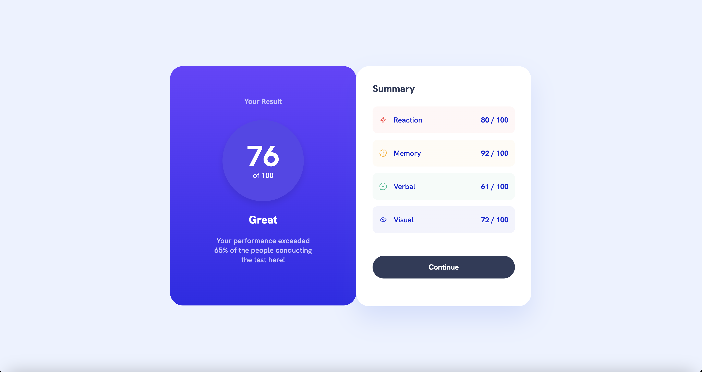

# 👋 Frontend Mentor - Results Summary Component Solution

This is a solution to the Results summary component challenge on Frontend Mentor. Frontend Mentor challenges help you improve your coding skills by building realistic projects. 🚀


## Table of Contents

- [Overview](#overview)
- [The Challenge](#the-challenge)
- [Screenshot](#screenshot)
- [Links](#links)
- [My Process](#my-process)
- [Built With](#built-with)
- [What I Learned](#what-i-learned)
- [Continued Development](#continued-development)
- [Useful Resources](#useful-resources)
- [Author](#author)
- [Acknowledgments](#acknowledgments)
## Overview
## The Challenge

The challenge was to build a results summary component and get it as close to the design as possible. The users should be able to:

- View the optimal layout for the interface depending on their device's screen size
- See hover and focus states for all interactive elements on the page
- Bonus: Use the local JSON data to dynamically populate the content
## Screenshot


## Links

- Solution URL: [Results Challenge](https://www.frontendmentor.io/solutions/results-challenge---jU3mcT_O)
- Live Site URL: [Summary Component](https://tuminha.github.io/summary-component/)
## My Process
## Built With

- Semantic HTML5 markup
- CSS custom properties
- Flexbox
- Mobile-first workflow
## What I Learned

This project was a great opportunity to practice building a responsive layout using Flexbox. I learned how to use media queries to adjust the layout for different screen sizes, and how to use CSS custom properties to make the code more maintainable. 🎉

Here are some snippets from the project:
```html
<!DOCTYPE html>
<html lang="en">
<head>
    <meta charset="UTF-8">
    <meta name="viewport" content="width=device-width, initial-scale=1.0">
    <link rel="icon" type="image/png" sizes="32x32" href="./assets/images/favicon-32x32.png">
    <title>Frontend Mentor | Results summary component</title>
    <link rel="stylesheet" href="./styles/style.css">
</head>
<body>
    <section class="results">
        <div class="results_left">
            <div class="result-left-text-box">
                <h3>Your Result</h3>
                <div class="result-circle">
                    <span class="result-score">76</span>
                    <span>of 100</span>
                </div>
                <h2>Great</h2>
                <p id="paragraph-score">Your performance exceeded 65% of the people conducting the test here!</p>
            </div>
        </div>
        <div class="results_right">
            <h3>Summary</h3>
            <div class="small-boxes">
    <div class="red">
        
        <p>Reaction</p>
        <p class="bold-number">80 / 100</p>
    </div>
    <div class="yellow">
        
        <p>Memory</p>
        <p class="bold-number">92 / 100</p>
    </div>
    <div class="green">
        
        <p>Verbal</p>
        <p class="bold-number">61 / 100</p>
    </div>
    <div class="blue">
        
        <p>Visual</p>
        <p class="bold-number">72 / 100</p>
    </div>
    </div>

        <button>Continue</button>
    </div>
  
```
```css
/* Import the fonts that are in the assets/fonts folder */
@import url('https://fonts.googleapis.com/css2?family=Hanken+Grotesk:wght@400;500;600;700;800&display=swap');

body {
    background: var(--Very-Light-blue, #ECF2FF);
    width: 100%;
    height: 100vh;
    font-family: Hanken Grotesk;
    font-size: 18px;
    font-style: normal;
    font-weight: 500;
    line-height: normal;
    display: flex;
    align-items: center;
    margin: 0;

}

.results {
    width: 100%;
    max-width: 1440px;
    margin: 0 auto;
    box-sizing: border-box;
    display: flex;
    justify-content: center;
    border-radius: 32px;
    background: var(--Very-Light-blue, #ECF2FF);
    margin: 250px 350px 250px 350px;
    
}

.results h1, .results h2 {
    font-family: 'Hanken Grotesk', sans-serif;
    font-weight: 800;
}

.results h2 {
    margin-top: 28px;
}
.results p {
    font-family: 'Hanken Grotesk', sans-serif;
    font-weight: 500;
    font-size: 18px;
}
.results .bold-number {
    font-weight: 700;
}


.results_left, .results_right {
    width: 100%;
    max-width: 375px;
    width: 350px;
    height: 512px;
}
.results_left {
    
    color: white;
    border-radius: 32px;
    background: var(--Gradient-1, linear-gradient(180deg, #75F 0%, #6943FF 0.01%, #2F2CE9 100%));
    align-items: center;
    padding-top: 38px;
    text-align: center;
    padding-bottom: 40px;
    padding-right: 54px;
    padding-left: 54px;
}

.result-left-text-box {
    margin: 38px 54px 55px 54px;
}

.results_left h3 {
    font-size: 18px;
    line-height: 22px;
    margin-bottom: 20px;
    color: var(--Light-Blue, #CAC9FF);
    font-family: Hanken Grotesk;
    font-feature-settings: 'clig' off, 'liga' off;

}

.results_left h1 {
    background: var(--Gradient-2, linear-gradient(180deg, #4D21C9 0%, rgba(37, 33, 201, 0.00) 100%, rgba(37, 33, 201, 0.00) 100%));
    width: 200px;
    height: 200px;
    display: flex;
    justify-content: center;
    align-items: center;
    border-radius: 50%;
    margin: auto;
    font-size: 72px;
    line-height: 56px;
    margin-bottom: 20px;
}

#paragraph-score {
    color: var(--Light-Blue, #CAC9FF);
    text-align: center;
    font-feature-settings: 'clig' off, 'liga' off;
}

.results_right {
    color: hsl(234, 85%, 45%);
    padding: 40px;
    border-radius: 32px;
    background: var(--White, #FFF);
    box-shadow: 0px 30px 60px 0px rgba(61, 108, 236, 0.15);
}

.results_right h3 {
    font-family: Hanken Grotesk;
    font-size: 24px;
    font-style: normal;
    font-weight: 700;
    line-height: normal;
    color: var(--Dark-Navy, #303B59);
    font-feature-settings: 'clig' off, 'liga' off;
    margin-top: 0;
    margin-bottom: 28px;

}

.small-boxes {
    display: flex;
    flex-direction: column;
    justify-content: space-between;
    
}

.small-boxes img {
    margin-right: 16px;
    
}

.red, .yellow, .green, .blue {
    display: flex;
    flex-direction: row;
    align-items: center;
    border-radius: 12px;
    padding: 5px 16px 5px 16px;
    margin-bottom: 16px;
    height: 56px;
    
}

.red {
    background: var(--red-95-white, linear-gradient(0deg, rgba(255, 255, 255, 0.95) 0%, rgba(255, 255, 255, 0.95) 100%), #F55);
}

.yellow {
    background: var(--yellow-95-white, linear-gradient(0deg, rgba(255, 255, 255, 0.95) 0%, rgba(255, 255, 255, 0.95) 100%), #FFB21E);
}

.green {
    background: var(--green-95-white, linear-gradient(0deg, rgba(255, 255, 255, 0.95) 0%, rgba(255, 255, 255, 0.95) 100%), #00BB8F);
}

.blue {
    background: var(--blue-95-white, linear-gradient(0deg, rgba(255, 255, 255, 0.95) 0%, rgba(255, 255, 255, 0.95) 100%), #1125D6);
}

.bold-number {
    margin-left: auto;
}

button {
    width: 100%;
    max-width: 375px;
    height: 56px;
    border: none;
    font-family: 'Hanken Grotesk', sans-serif;
    font-weight: 700;
    font-size: 18px;
    line-height: 22px;
    color: hsl(0, 0%, 100%);
    border-radius: 128px;
    background-color: var(--Dark-Navy, #303B59);
    cursor: pointer;
    transition: all 0.3s ease-in-out;
    text-align: center;
    margin-top: 40px;

}

button:hover {
    background: var(--Gradient-1, linear-gradient(180deg, #75F 0%, #6943FF 0.01%, #2F2CE9 100%));
}

.attribution {
    margin-top: 200px;
    font-size: 11px;
    text-align: center;
}
.attribution a {
    color: hsl(228, 45%, 44%);
}
```


## Continued Development

In future projects, I want to continue focusing on creating responsive layouts. I also want to practice using CSS Grid, as it provides even more flexibility for complex layouts. 📚
## Useful Resources

- CSS Tricks - A Complete Guide to Flexbox - This helped me understand Flexbox. I really liked this guide and will use it going forward. 📖
- MDN - Using media queries - This is an amazing article which helped me finally understand media queries. I'd recommend it to anyone still learning this concept. 📚
## Author

- Website - [Francisco Teixeira Barbosa](#https://periospot.com)
- Frontend Mentor - [@Tuminha](#https://www.frontendmentor.io/profile/Tuminha)
- Twitter - [@cisco_research](https://twitter.com/cisco_research)
## Acknowledgments

I would like to thank Frontend Mentor for providing this challenge. It was a great opportunity to practice my skills and learn new techniques. 🙏
